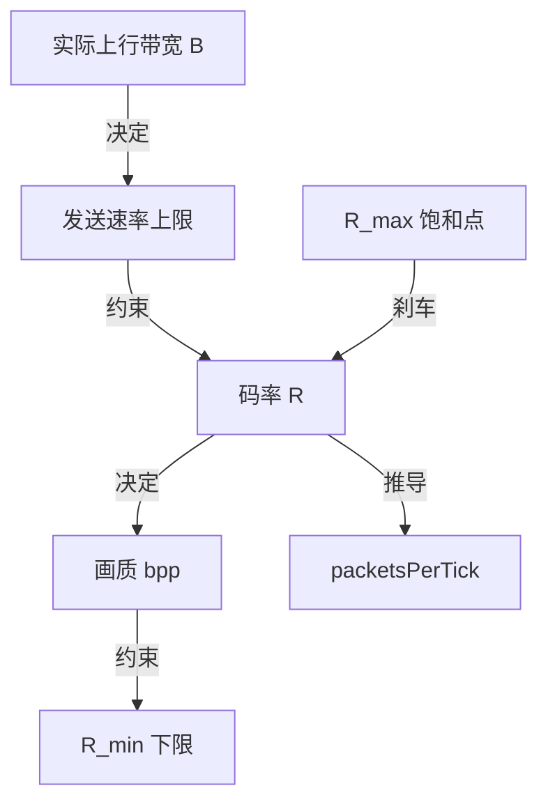
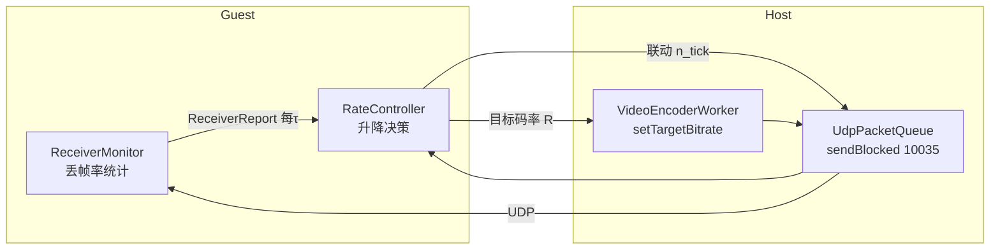
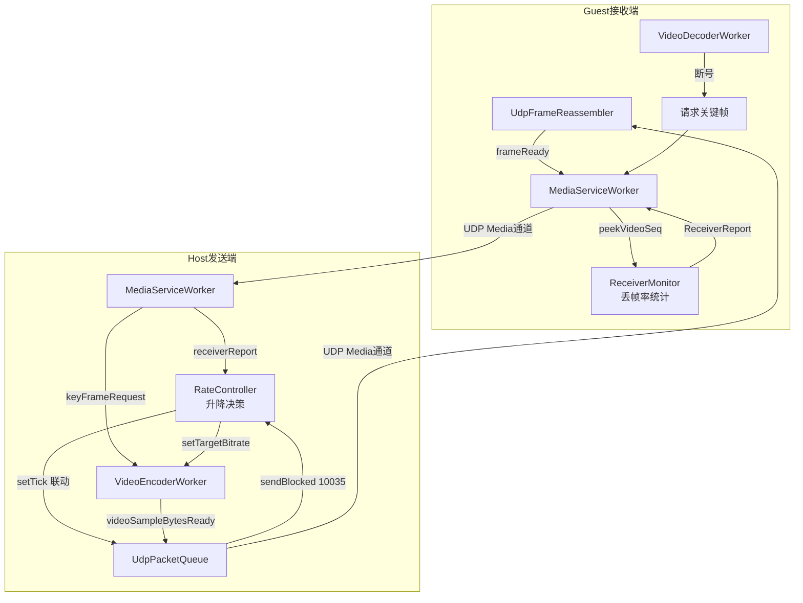

# 参数体系总结（含单位，全符号化）

## 一、符号定义

### 1. 业务输入（用户/环境决定）

| 符号 | 含义 | 单位 |
|---|---|---|
| $W, H$ | 分辨率宽、高 | px |
| $fps$ | 帧率 | 帧/s |
| $B$ | 实际上行带宽 | Mbps |
| $p$ | 丢包率 | 无量纲，$0 \sim 1$ |

### 2. 可调参数（程序控制）

| 符号 | 含义 | 单位 |
|---|---|---|
| $R$ | 视频码率 | kbps |
| $G$ | GOP 长度 | 帧 |
| $n_{tick}$ | 每 tick 发送包数（packetsPerTick） | 片/tick |
| $t_{tick}$ | 发送节拍间隔（flushIntervalMs） | ms/tick |

### 3. 系统常量（代码/协议决定）

| 符号 | 含义 | 单位 | 来源 |
|---|---|---|---|
| $P_{payload}$ | UDP 单包 payload 上限 | 字节 | `MaxDatagramSize - FixedHeaderSize` |
| $P_{dgram}$ | 单包线上总大小 | 字节 | `MaxDatagramSize + 帧开销` |
| $\beta_k$ | 千倍换算 | 无量纲 | $1000$（k↔单位换算） |
| $\beta_b$ | 字节比特换算 | bit/字节 | $8$ |

### 4. 经验常量（算法参数，可调）

| 符号 | 含义 | 单位 | 典型值 |
|---|---|---|---|
| $bpp_{min}$ | 画质下限密度 | bit/(px·帧) | $0.06$ |
| $bpp_{max}$ | 画质饱和密度 | bit/(px·帧) | $0.2$ |
| $\alpha$ | IDR 相对平均帧的倍数 | 无量纲 | $5 \sim 10$ |
| $k_{pace}$ | 发送速率/码率 的倍数 | 无量纲 | $2.5$ |
| $\tau$ | 自适应评估周期 | ms | $1000$ |
| $P_{th}$ | IDR 完整率目标 | 无量纲 | $0.8$ |

---

## 二、核心公式

### 1. 平均帧大小

$$\text{avgFrame} = \frac{R \times \beta_k}{\beta_b \times fps} \quad (\text{字节})$$

### 2. IDR 帧大小

$$\text{idrBytes} = \alpha \times \text{avgFrame} \quad (\text{字节})$$

### 3. 分片数

$$N = \left\lceil \frac{\text{avgFrame}}{P_{payload}} \right\rceil, \qquad N_{idr} = \left\lceil \frac{\text{idrBytes}}{P_{payload}} \right\rceil \quad (\text{片})$$

### 4. 画质密度

$$\text{bpp} = \frac{R \times \beta_k}{W \times H \times fps} \quad \left(\frac{\text{bit}}{\text{px}\cdot\text{帧}}\right)$$

### 5. 发送速率（节流决定）

$$S = \frac{n_{tick} \times P_{dgram} \times \beta_k}{t_{tick}} \quad (\text{字节/s})$$

---

## 三、约束条件

### 1. 码率范围（画质约束）

$$\underbrace{\frac{bpp_{min} \times W \times H \times fps}{\beta_k}}_{\text{下限 } R_{min}} \le R \le \underbrace{\frac{bpp_{max} \times W \times H \times fps}{\beta_k}}_{\text{上限 } R_{max}}$$

### 2. 发送能力约束（不积压）

$$S \ge R \times \frac{\beta_k}{\beta_b} \quad (\text{字节/s})$$

即发送速率必须 ≥ 码率换算后的字节流，否则队列积压。

### 3. 无卡顿传输约束（IDR 在帧间隔内传完）

$$\frac{\text{idrBytes}}{S} \le \frac{1}{fps}$$

### 4. IDR 完整率约束（抗丢包）

$$(1 - p)^{N_{idr}} \ge P_{th}$$

---

## 四、参数联动关系（自适应的核心）

### 1. 发送节拍跟随码率

发送速率恒为码率的 $k_{pace}$ 倍：

$$S = k_{pace} \times R \times \frac{\beta_k}{\beta_b}$$

代入 $S$ 的定义，反解出：

$$n_{tick} = \frac{k_{pace} \times R \times t_{tick}}{\beta_b \times P_{dgram}} \quad (\text{片/tick})$$

**含义**：$n_{tick}$ 不独立调节，由 $R$ 推导，两者永远同步。

### 2. 码率自适应（三信号）

每 $\tau$ 评估一次，按优先级：

| 优先级 | 信号 | 条件 | 动作 |
|---|---|---|---|
| 1 | sendBlocked（10035） | 内核发送缓冲满 | $R \gets R \times 0.7$，进冷却 |
| 2 | 频繁断号 | $N_{kf} \ge 3$ | $R \gets R \times 0.5$ |
| 3 | guest 丢帧率 | $p \ge p_{high}$ | $R \gets R \times 0.7$ |
| 4 | 冷却期内 | — | 保持 |
| 5 | 探测升 | 连续 $T_{idle}$ 秒无 10035 且 $p < p_{low}$ | $R \gets R + \min(\delta_{up} \times R,\ \dfrac{R_{max}-R}{2})$ |
| 6 | 其他（死区 $p_{low} \le p < p_{high}$） | — | 保持 |

其中 $N_{kf}$ 与 $p$ 均由 guest 通过 ReceiverReport **同时上报**；$N_{kf}\ge3$ 更严重（腰斩），$p\ge p_{high}$ 温和降，$p$ 落在死区内不处理。

| 符号 | 含义 | 典型值 |
|---|---|---|
| $p_{low}$ | "好"的丢包阈值 | $0.01$ |
| $p_{high}$ | "坏"的丢包阈值 | $0.03$ |
| $N_{kf}$ | 每周期关键帧请求次数 | 统计值 |
| $\delta_{up}$ | 单次最大增幅 | $0.10$ |
| $T_{idle}$ | 无信号空闲时长（触发升） | $3$ s |
| $T_{cool}$ | 降后冷却期 / 10035 防抖间隔 | $2$ s |

### 3. 码率刹车（渐进减速）

每次可升时，增幅取两者较小值：

$$\Delta R = \min\left(\delta_{up} \times R,\ \frac{R_{max} - R}{2}\right)$$

- 离 $R_{max}$ 越近，增量越小 → 逼近但永不超上限
- 升慢（渐进减速）、降快（×0.5/×0.7）

---

## 五、带宽、画质、码率的关系总览

- **带宽 $B$** 决定 $R$ 能涨到多高（通过丢包/积压信号间接限制）
- **画质** 由 bpp 决定，给出 $R$ 的上下限
- **码率 $R$** 是唯一的自适应变量，$n_{tick}$ 由它推导

---

## 六、实现思路定稿

### 1. 总体架构：三信号（两个降 + 一个升）

**三个信号（两个降、一个升）**

| 信号 | 来源 | 检测什么 | 作用 |
|---|---|---|---|
| sendBlocked（10035） | host 本地 | 内核发送缓冲满 | 降（快，替代堆帧检测） |
| 丢帧率 | guest 反馈 | 端到端丢包 | 降（兜底，含中间链路） |
| 定时探测 | host 定时 | 长时间无 10035/丢包 | 升 |

### 2. 丢帧率测量（guest 端）

在 `MediaServiceWorker::onUdpMediaFrameReceived` 收帧处，用现成的
`VideoSampleCodec::peekVideoSeq` 提取 `videoSeq`，统计帧号缺口：

$$\text{丢帧率} = \frac{(\text{seq}_{max} - \text{seq}_{min} + 1) - \text{实收帧数}}{\text{seq}_{max} - \text{seq}_{min} + 1}$$

- 每 $\tau$ 结算一次，发 `ReceiverReport`，清零重计
- **注意**：seq 回绕（quint32 溢出）用环形差值 `& 0xFFFFFFFF` 处理
- 统计位置选在到达层（到达即算收到），避免解码器"等关键帧主动丢帧"干扰

### 3. 反馈报文 ReceiverReport

`UdpFrameType` 新增 `ReceiverReport = 9`，payload 结构：

| 字段 | 含义 |
|---|---|
| expectFrames | 本周期期望帧数 |
| receivedFrames | 实际收到帧数 |
| keyFrameReq | 关键帧请求次数 |
| timestampMs | 结算时间戳 |

复用现有 `KeyFrameRequest` 的回传链路（guest → host UDP 控制通道）。

### 4. 决策逻辑（三信号简化版）

每 $\tau$ 评估一次，按优先级：

| 优先级 | 信号 | 条件 | 动作 |
|---|---|---|---|
| 1 | sendBlocked（10035） | 内核发送缓冲满 | $R\times0.7$，进冷却 |
| 2 | 频繁断号 | $N_{kf}\ge3$ | $R\times0.5$ |
| 3 | guest 丢帧率 | $p\ge p_{high}$ | $R\times0.7$ |
| 4 | 冷却期内 | — | 保持 |
| 5 | 探测升 | 连续 $T_{idle}$ 秒无 10035 且 $p<p_{low}$ | $R+\min(\delta_{up}R,\ \frac{R_{max}-R}{2})$ |
| 6 | 其他 | — | 保持 |

新增常量：

| 符号 | 含义 | 典型值 |
|---|---|---|
| $T_{idle}$ | 无信号空闲时长（触发升） | $3$ s |
| $T_{cool}$ | 降后冷却期 / 10035 防抖间隔 | $2$ s |

**关键**：10035 是内核级即时信号，替代了原"堆帧检测"（队列阈值 + 连续周期判定）；guest 丢帧率兜底中间链路丢包；探测升保证网络恢复后画质回升。

### 5. 码率执行（双输出联动）

`RateController` 每次算出目标码率 $R$ 后，同步两个输出：

1. **编码器**：`setTargetBitrate(R)` → 在编码线程改 `h264CodecContext_->bit_rate`（x264 运行时 reconfig，线程安全）
2. **发送队列**：$n_{tick} = \dfrac{k_{pace}\times R\times t_{tick}}{\beta_b\times P_{dgram}}$ → 保证发送速率恒为码率 $k_{pace}$ 倍

### 6. 模块划分

**新增文件**

| 文件 | 职责 |
|---|---|
| `Common/ReceiverReport.h/.cpp` | 反馈报文结构 + 编解码 |
| `Client/ReceiverMonitor.h/.cpp` | guest 端丢帧率统计，定时发报告 |
| `Client/RateController.h/.cpp` | host 端三信号升降决策 |

**改动文件**

| 文件 | 改动 |
|---|---|
| `Udp/UdpPacket.h` | `UdpFrameType` 加 `ReceiverReport` |
| `Client/MediaServiceWorker.h/.cpp` | 加 `sendReceiverReport` / `receiverReportReceived` |
| `Media/Video/VideoEncoderWorker.h/.cpp` | 加 `setTargetBitrate` 槽 |
| `Udp/UdpPacketQueue.h/.cpp` | 发送失败包放回队首 + `sendBlocked` 信号 |
| `Client/ClientApp.cpp` | 连接新信号 |

### 7. 实现步骤（分阶段）

1. **反馈通道**：`UdpFrameType::ReceiverReport` + `ReceiverReport` 编解码
2. **guest 端统计**：`ReceiverMonitor` 丢帧率统计 + 定时发报告
3. **host 端决策**：`RateController` 三信号升降决策
4. **码率执行**：`setTargetBitrate` + `n_{tick}` 联动
5. **联调验证**：本机跑通 → 真实网络测收敛与稳定性

### 8. 裕量来源总结

带宽裕量 = 升慢降快（自带 ~15%）+ 10035 发送阻塞刹车（事前信号）。码率最终稳定在带宽的 75%~80%。

---

## 七、自适应系统详细架构总结

### 7.1 系统目标

根据网络实时状况，动态调整码率（后续扩展 fps、分辨率），使画质始终维持在"当前网络能支持的最好水平"，同时满足：不震荡、不打爆带宽、不卡帧。

### 7.2 完整数据流

### 7.3 控制信号收发链路

| 方向 | 信号 | 帧类型 | 发送方触发 | 接收方处理 |
|---|---|---|---|---|
| guest → host | 关键帧请求 | `KeyFrameRequest` | 解码器断号 | `encoderWorker.requestKeyFrame` |
| guest → host | 丢帧率反馈 | `ReceiverReport`（新增） | `ReceiverMonitor` 每 τ | `RateController.onReceiverReport` |
| guest → host | 输入事件 | `InputEvent` | 输入捕获 | 注入 |
| host → guest | 无 | — | 码率/分辨率变化由 H264 SPS 自动传递 | 解码器自动重建 |

**关键结论**：自适应系统的控制信号是 **guest 单向反馈 + host 本地执行**，host 不需要往回发控制信号。

### 7.4 信号测量

#### 7.4.1 丢帧率（guest 端，事后信号）

在 `MediaServiceWorker` 收帧处用 `peekVideoSeq` 提取 `videoSeq`，每 τ 结算：

$$\text{loss} = \frac{(\text{seq}_{max}-\text{seq}_{min}+1)-\text{实收帧数}}{\text{seq}_{max}-\text{seq}_{min}+1}$$

- seq 回绕用环形差值处理
- 到达层统计（到达即算收到），不受解码器"等关键帧主动丢帧"干扰

#### 7.4.2 发送阻塞（host 端，10035，事前信号）

`UdpPacketQueue::writePacket` 发送失败（内核缓冲满，WSAEWOULDBLOCK 10035）时：

1. 包放回队首，**不丢弃**
2. 停止本 tick 发送
3. emit `sendBlocked` 信号

`RateController` 收到 `sendBlocked` → 立即降码率（毫秒级响应，无需队列统计和阈值计算）。触发需防抖（$T_{cool}$ 内不重复降）。

**与丢帧率的互补**：10035 只检测 host 本地内核缓冲满；中间路由器丢包时 `writeDatagram` 仍会成功，必须靠 guest 丢帧率兜底。

### 7.5 决策逻辑（三信号简化版）

每 $\tau$ 评估一次，按优先级：

| 优先级 | 信号 | 条件 | 动作 |
|---|---|---|---|
| 1 | sendBlocked（10035） | 内核发送缓冲满 | $R\times0.7$，进冷却 |
| 2 | 频繁断号 | $N_{kf}\ge3$ | $R\times0.5$ |
| 3 | guest 丢帧率 | $p\ge p_{high}$ | $R\times0.7$ |
| 4 | 冷却期内 | — | 保持 |
| 5 | 探测升 | 连续 $T_{idle}$ 秒无 10035 且 $p<p_{low}$ | $R+\min(\delta_{up}R,\ \frac{R_{max}-R}{2})$ |
| 6 | 其他 | — | 保持 |

### 7.6 参数计算原则（无魔法数字）

| 类型 | 处理方式 |
|---|---|
| 有语义系数（$k_{pace}$、$bpp_{min/max}$、$\delta_{up}$、$p_{low}$、$p_{high}$、$T_{idle}$、$T_{cool}$） | 命名常量，集中管理 |
| 可推导量（$R_{min}$、$R_{max}$、$n_{tick}$） | 运行时从 $W,H,fps,R$ 计算 |

代码里不允许出现 50、1800 这类散落的裸数字。

### 7.7 抗震荡机制（简化）

1. **冷却期**：每次降码率后强制 $T_{cool}$ 秒不升
2. **10035 防抖**：$T_{cool}$ 内不重复触发降码率
3. **探测空闲期**：连续 $T_{idle}$ 秒无信号才升，避免刚降完就升的拉扯

### 7.8 带宽裕量来源

1. 升慢降快（$+10\%$ vs $-30\%$）→ 自带 ~15% 裕量
2. 10035 发送阻塞 → 触顶前就退

最终码率稳定在带宽的 75%~80%。

### 7.9 刹车与降级

- **码率刹车**：$R_{max}=bpp_{max}\times W\times H\times fps/\beta_k$，渐进减速逼近
- **降级阶梯**（极端情况）：码率触 $R_{min}$ 仍丢包 → 降 fps → 降分辨率；网络恢复反向升

### 7.10 模块与实现顺序

**新增**：`Common/ReceiverReport`、`Client/ReceiverMonitor`、`Client/RateController`

**改动**：`Udp/UdpPacket.h`、`Client/MediaServiceWorker`、`Media/Video/VideoEncoderWorker`、`Udp/UdpPacketQueue`、`Client/ClientApp`

**实现顺序**：

1. 反馈通道（`ReceiverReport` 帧类型 + 编解码）
2. guest 端 `ReceiverMonitor`（丢帧率统计 + 定时反馈）
3. host 端 `RateController`（三信号升降决策）
4. 码率执行（`setTargetBitrate` + `n_{tick}` 联动）
5. 联调验证（本机 → 真实网络测收敛）